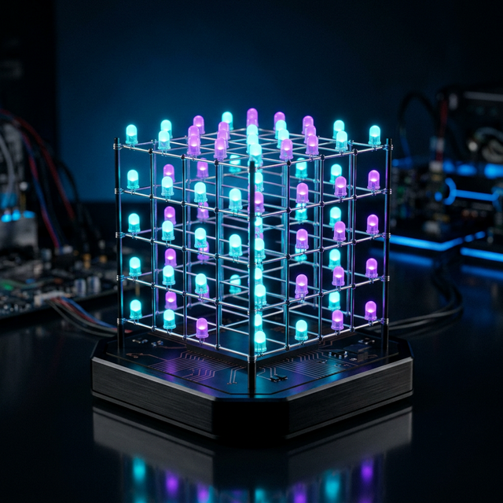
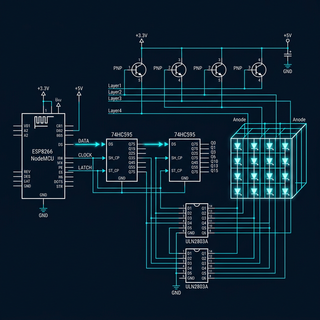
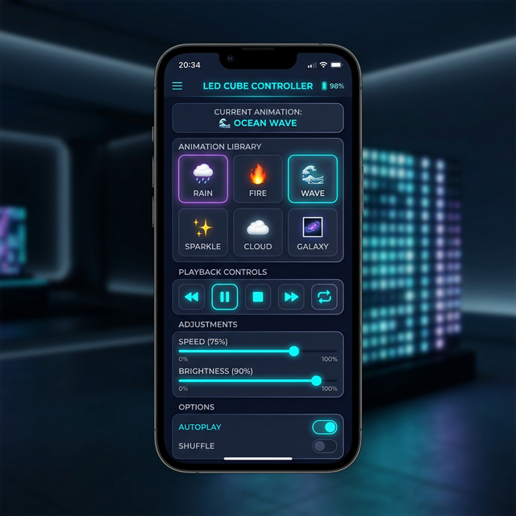

<div align="center">

# ⚡ ESP8266 LED CUBE ⚡

### *A WiFi-Controlled 4×4×4 LED Cube with 20 Animations & Real-Time 3D Visualization*

<br>



<br>

[](https://www.espressif.com/)
[](#)
[](#-animation-library)
[](LICENSE)
[](https://platformio.org/)

---

*Transform 64 LEDs into a mesmerizing 3D light show — controlled from anywhere on your network through a futuristic web dashboard with real-time 3D cube visualization.*

<br>

[🚀 Quick Start](#-quick-start) •
[🏗️ Hardware](#%EF%B8%8F-hardware-architecture) •
[🎨 Animations](#-animation-library) •
[🌐 Web Interface](#-web-interface) •
[📡 API Reference](#-websocket-api) •
[🛠️ Build Guide](#%EF%B8%8F-build--flash)

</div>

---

## ✨ Highlights

```
🔮  64 individually addressable LEDs in a stunning 3D matrix
🎬  20 built-in animation effects with adjustable parameters
🌐  WiFi control — no wires, no apps, just open a browser
🧊  Real-time Three.js 3D cube visualization in your browser
🖌️  Paint Mode — Map your physical LED colours to the 3D simulation
✏️  Voxel editor — draw custom patterns and save them
📡  WebSocket communication for instant, lag-free control
🔄  OTA firmware updates — flash wirelessly over WiFi
📱  Fully responsive — works on phones, tablets, and desktops
⚡  Flicker-free 100Hz multiplexed display refresh
💾  Save up to 10 custom patterns to flash storage
```

---

## 🏗️ Hardware Architecture

<div align="center">



</div>

### Signal Flow

```
                    ┌──────────────┐
                    │   ESP8266    │
                    │  (NodeMCU)   │
                    └──┬──┬──┬──┬─┘
                       │  │  │  │
              DATA ────┘  │  │  └──── LAYER PINS (D5-D8)
              CLOCK ──────┘  │             │
              LATCH ─────────┘             │
                       │                   │
              ┌────────▼────────┐    ┌─────▼──────┐
              │   74HC595 #1    │    │    PNP      │
              │   74HC595 #2    │    │ Transistors  │
              │  (16-bit shift) │    │  (× 4)      │
              └────────┬────────┘    └─────┬──────┘
                       │                   │
              ┌────────▼────────┐          │
              │   ULN2803 #1    │          │
              │   ULN2803 #2    │     LAYER ANODES
              │ (current sink)  │      (+5V each)
              └────────┬────────┘
                       │
                COLUMN CATHODES
                  (16 columns)
                       │
              ┌────────▼────────┐
              │                 │
              │   4 × 4 × 4    │
              │   LED CUBE     │
              │   (64 LEDs)    │
              │                 │
              └─────────────────┘
```

### 🔌 Pin Configuration

| ESP8266 Pin | GPIO | Function | Connected To |
|:-----------:|:----:|:--------:|:-------------|
| **D3** | GPIO0 | `DATA` | 74HC595 SER (Serial Data Input) |
| **D2** | GPIO4 | `CLOCK` | 74HC595 SRCLK (Shift Clock) |
| **D1** | GPIO5 | `LATCH` | 74HC595 RCLK (Storage Latch) |
| **D5** | GPIO14 | `LAYER 1` | PNP Base → Bottom Layer Anode |
| **D6** | GPIO12 | `LAYER 2` | PNP Base → Layer 2 Anode |
| **D7** | GPIO13 | `LAYER 3` | PNP Base → Layer 3 Anode |
| **D8** | GPIO15 | `LAYER 4` | PNP Base → Top Layer Anode |

### 📦 Bill of Materials

| Component | Quantity | Description |
|:----------|:--------:|:------------|
| NodeMCU ESP8266 | 1 | WiFi microcontroller (ESP-12E module) |
| 74HC595 | 2 | 8-bit serial-in, parallel-out shift register |
| ULN2803A | 2 | 8-channel Darlington transistor array (current sink) |
| PNP Transistor (2N3906) | 4 | Layer anode switch (or IRF9540N P-MOSFET) |
| 5mm LEDs | 64 | Common anode, any color (diffused recommended) |
| 10kΩ Resistor | 4 | PNP transistor base resistors |
| 220Ω Resistor | 16 | LED current limiting (optional with ULN2803) |
| 5V Power Supply | 1 | 2A+ recommended for full brightness |
| Perfboard / PCB | 1 | For mounting the cube and drivers |
| Pin Headers & Wires | — | For connections |

### 🔍 How Multiplexing Works

> The cube uses **persistence of vision** — only one layer is lit at any moment, but they switch so fast your eyes see all four simultaneously.

```
Frame Cycle (~10ms = 100Hz, flicker-free):

  ┌─ Layer 1 ON ──── 2.5ms ────┐
  │  Layer 2 ON ──── 2.5ms ──  │
  │  Layer 3 ON ──── 2.5ms ──  │
  │  Layer 4 ON ──── 2.5ms ──  │
  └──── REPEAT ────────────────┘

Each layer cycle:
  1. Turn OFF all layers (prevent ghosting)
  2. Shift 16-bit column data → 74HC595 chain
  3. Pulse LATCH pin (transfer to outputs)
  4. Turn ON target layer (PNP transistor → LOW)
  5. Hold for 2.5ms
  6. Advance to next layer
```

**Why ULN2803?** The shift registers output 5V logic, but can't source enough current for LEDs. The ULN2803 Darlington array acts as a **current sink**: when the 595 output goes HIGH, the ULN2803 pulls the cathode LOW through a Darlington pair, allowing ~500mA per chip to flow through the LEDs.

**Why PNP Transistors?** Common-anode layers need **+5V switched to them**. A PNP transistor (or P-MOSFET) conducts when its base/gate goes LOW, connecting the layer to VCC. This is controlled directly by ESP8266 GPIO pins.

---

## 🎨 Animation Library

20 stunning built-in effects, each with **adjustable speed, brightness, direction, and density**.

<div align="center">

| # | Animation | Icon | Description |
|:-:|:----------|:----:|:------------|
| 1 | **Rain** | 🌧️ | Raindrops fall from the sky, pooling at the bottom |
| 2 | **Wave** | 🌊 | Sine wave sweeps across the cube surface |
| 3 | **Spiral** | 🌀 | LEDs spiral upward through all layers |
| 4 | **Sparkle** | ✨ | Random LEDs flash like twinkling stars |
| 5 | **Expanding Cube** | 📦 | Hollow wireframe cube grows outward |
| 6 | **Shrinking Cube** | 🔲 | Full cube contracts to a single point |
| 7 | **Snake** | 🐍 | A glowing snake slithers through 3D space |
| 8 | **Fire** | 🔥 | Flames rise and flicker from the base |
| 9 | **Ripple** | 💧 | Concentric waves radiate from center |
| 10 | **Plane Sweep** | 📐 | Solid plane sweeps across any axis |
| 11 | **Voxel Bounce** | ⚡ | A single pixel bounces off invisible walls |
| 12 | **Random Voxel** | 🎲 | Random LEDs fill up, then clear |
| 13 | **Rotating Planes** | 🔄 | A vertical plane rotates around center |
| 14 | **Knight Rider** | 🚗 | Scanning bar sweeps back and forth |
| 15 | **Orbiting Point** | 🪐 | Point traces a 3D orbital path |
| 16 | **Cube Explosion** | 💥 | 8 corner voxels explode outward |
| 17 | **Heartbeat** | 💓 | Double-beat pulse, like a heart |
| 18 | **Breathing** | 😮‍💨 | All LEDs fade in and out smoothly |
| 19 | **Falling Sand** | ⏳ | Particles fall and stack with gravity |
| 20 | **Lightning** | ⚡ | Random lightning bolts strike downward |

</div>

### Animation Parameters

Every animation supports real-time parameter adjustments:

| Parameter | Range | Description |
|:----------|:-----:|:------------|
| **Speed** | 20–500ms | Animation step interval (lower = faster) |
| **Brightness** | 10–255 | LED brightness via PWM layer timing |
| **Direction** | 6 directions | Up, Down, Left, Right, Forward, Backward |
| **Density** | 1–16 | Particle count for effects like Rain, Sparkle, Fire |

---

## 🌐 Web Interface

Control your cube from any device on the same WiFi network — just open the cube's IP address in a browser.

<div align="center">



</div>

### Dashboard Features

| Feature | Description |
|:--------|:------------|
| 🧊 **Live 3D Preview** | Mini auto-rotating 3D visualization right on the dashboard |
| 🎬 **Animation Grid** | Visual tile grid with icons — tap to switch |
| ▶️ **Playback Controls** | Play, Pause, Stop, Previous, Next |
| 🔀 **Autoplay & Shuffle** | Automatic animation cycling with random mode |
| 🎚️ **Parameter Sliders** | Speed, Brightness, Density — real-time adjustment |
| 🧭 **Direction Selector** | 6-way direction control buttons |

### 3D Cube Visualizer

A real-time **Three.js** 3D model of your LED cube — right in the browser:

- 🖱️ **Drag** to rotate the view
- 🔍 **Scroll** to zoom in/out
- 📱 **Touch** support for mobile devices
- 💡 LED spheres **glow and pulse** when active
- 🔄 **Synchronized** with the real cube via WebSocket

### Voxel Pattern Editor

Design your own 3D patterns and configure hardware colours:

- ✏️ **Draw Pattern Mode**: Click cells to toggle individual LEDs on/off, creating custom animation frames.
- 🖌️ **Paint Hardware Colours Mode**: Map the physical colours of your soldered LEDs into the 3D simulation so it perfectly mirrors your hardware.
- 🎨 **Colour Tools**: Pick any hex colour and "Fill Layer" or "Fill All" instantly.
- 📚 **Layer tabs** — edit one layer at a time (Bottom → Top)
- 💾 **10 save slots** — store patterns on the ESP's flash
- 📋 **JSON export** — copy pattern data to clipboard
- 🔄 **Live preview** — see changes instantly on the real cube

### System Panel

- 📊 Firmware version, free heap memory, uptime
- 📶 WiFi signal strength (RSSI)
- 🔄 Cube refresh rate (FPS)
- 💾 Saved pattern count
- 📡 OTA update instructions with ready-to-use command

### Design Aesthetic

```
🖤 Dark glassmorphism theme
💎 Neon cyan / magenta / purple accents
✨ Animated gradient background
🌟 Glowing buttons and controls
🎨 Smooth micro-animations throughout
📱 Fully responsive (mobile ↔ desktop)
```

---

## 📡 WebSocket API

Real-time control via WebSocket on **port 81**. All messages use JSON.

### Client → Cube

```jsonc
// Switch animation (0-19)
{ "cmd": "setAnim", "value": 5 }

// Playback control
{ "cmd": "play" }
{ "cmd": "pause" }
{ "cmd": "stop" }
{ "cmd": "next" }
{ "cmd": "prev" }

// Adjust parameters
{ "cmd": "speed", "value": 100 }        // 20-500 ms
{ "cmd": "brightness", "value": 200 }    // 10-255
{ "cmd": "direction", "value": 0 }       // 0=Up, 1=Down, 2=Left, 3=Right, 4=Fwd, 5=Back
{ "cmd": "density", "value": 4 }         // 1-16

// Mode toggles
{ "cmd": "autoplay", "value": true }
{ "cmd": "random", "value": true }

// Direct voxel control
{ "cmd": "setVoxel", "x": 2, "y": 1, "z": 3, "state": true }
{ "cmd": "setBuffer", "layers": [65535, 0, 0, 65535] }
{ "cmd": "clearAll" }
{ "cmd": "fillAll" }

// Pattern storage
{ "cmd": "savePattern", "slot": 0 }      // 0-9
{ "cmd": "loadPattern", "slot": 0 }

// Request state
{ "cmd": "getState" }
{ "cmd": "getAnims" }
```

### Cube → Client

```jsonc
// Status update (sent on every change + periodically)
{
  "type": "status",
  "animation": "Rain",
  "animIndex": 0,
  "playing": true,
  "autoplay": false,
  "randomMode": false,
  "speed": 100,
  "brightness": 200,
  "direction": 0,
  "density": 4,
  "fps": 100.0,
  "heap": 35000,
  "uptime": 3600,
  "patterns": 3
}

// Real-time cube state (broadcast every 200ms)
{
  "type": "cubeState",
  "layers": [0, 4680, 4680, 0]    // 16-bit per layer
}

// Animation list (sent on connect)
{
  "type": "animList",
  "anims": ["Rain", "Wave", "Spiral", ...]
}
```

### REST API

```
GET /api/status    → Full system status JSON
GET /              → Web interface (index.html)
GET /{filename}    → Static files from LittleFS
```

---

## 🛠️ Build & Flash

### Prerequisites

| Tool | Purpose |
|:-----|:--------|
| [PlatformIO](https://platformio.org/) | Build system (VS Code extension or CLI) |
| USB Cable | For initial firmware upload |
| 5V Power Supply | External power for the LED cube |

### 🚀 Quick Start

```bash
# 1. Clone the repository
git clone https://github.com/Am4l-babu/ESP8266-LED-CUBE.git
cd ESP8266-LED-CUBE

# 2. Build the firmware
pio run

# 3. Connect NodeMCU via USB and upload firmware
pio run -t upload

# 4. Build and upload web files to LittleFS
pio run -t buildfs
pio run -t uploadfs

# 5. Open Serial Monitor (115200 baud) — note the IP address
pio device monitor

# 6. Open the IP address in your browser 🎉
```

### OTA (Over-the-Air) Updates

After the initial USB flash, update wirelessly:

```bash
# Upload firmware via WiFi
pio run -t upload --upload-port <CUBE_IP>

# Upload web files via WiFi
pio run -t uploadfs --upload-port <CUBE_IP>
```

> The OTA hostname is `led-cube`. You can also use `led-cube.local` on mDNS-capable networks.

---

## 📁 Project Structure

```
ESP8266-LED-CUBE/
│
├── 📄 platformio.ini           # PlatformIO configuration
├── 📄 README.md                # You are here!
│
├── 📂 include/                 # Header files
│   ├── cube_engine.h           # Cube hardware driver interface
│   ├── animations.h            # Animation engine & effect declarations
│   ├── webserver.h             # Web + WebSocket server interface
│   ├── secrets.h               # 🔒 YOUR credentials (gitignored)
│   └── secrets_template.h      # 📋 Template — copy to secrets.h
│
├── 📂 src/                     # Firmware source code
│   ├── main.cpp                # Entry point: WiFi, OTA, main loop
│   ├── cube_engine.cpp         # Multiplexing, shift registers, 3D addressing
│   ├── animations.cpp          # 20 non-blocking animation implementations
│   └── webserver.cpp           # HTTP routes, WebSocket handlers, JSON protocol
│
├── 📂 data/                    # Web assets (uploaded to LittleFS)
│   ├── index.html              # Single-page web application
│   ├── styles.css              # Futuristic dark neon theme
│   ├── cube_visualizer.js      # Three.js interactive 3D cube
│   └── voxel_editor.js         # Pattern editor with save/load
│
└── 📂 docs/
    └── 📂 images/              # README images
        ├── hero.png
        ├── circuit.png
        └── web_ui.png
```

---

## 📐 Coordinate System

```
          Z (layers, bottom=0 → top=3)
          ▲
          │    Y (rows, front=0 → back=3)
          │   ╱
          │  ╱
          │ ╱
          │╱
          ┼──────────► X (columns, left=0 → right=3)

  Voxel address: setVoxel(x, y, z)
  
  Frame buffer: 4 × uint16_t
    Layer[z] bit mapping: bit[y×4 + x]
    
  Example: setVoxel(2, 1, 3)
    → Layer 3, bit position = 1×4 + 2 = 6
    → frameBuffer[3] |= (1 << 6)
```

---

## 📶 WiFi Configuration

> **🔒 Credentials are stored in `include/secrets.h`** — this file is gitignored and never committed.

### First-Time Setup

```bash
# Copy the template to create your secrets file
cp include/secrets_template.h include/secrets.h
```

Then edit `include/secrets.h` with your WiFi credentials:

```cpp
#define WIFI_SSID     "YourNetworkName"
#define WIFI_PASSWORD "YourWiFiPassword"

#define AP_SSID       "LED-Cube-AP"     // Fallback AP name
#define AP_PASSWORD   "ledcube123"      // Fallback AP password

#define OTA_HOSTNAME  "led-cube"        // mDNS hostname for OTA
```

### AP Fallback Mode

If WiFi connection fails after 20 seconds, the cube automatically creates its own access point:

| Setting | Default Value |
|:--------|:--------------|
| **AP SSID** | `LED-Cube-AP` |
| **AP Password** | `ledcube123` |
| **AP IP** | `192.168.4.1` |

> Connect to the AP network and navigate to `192.168.4.1` to control the cube.

---

## 🔧 Customization

### Adding a New Animation

1. Add the animation name to the `AnimationType` enum in `animations.h`
2. Add the animation name string to `ANIM_NAMES[]`
3. Implement the animation function in `animations.cpp`
4. Add the function call in the `update()` switch statement
5. Increment `ANIM_COUNT` (it's automatic if you add before the count)

```cpp
// Example: New animation in animations.cpp
void AnimationEngine::animMyEffect() {
    cube.clearAll();
    
    // Your custom animation logic here
    // Use millis()-based timing, NOT delay()
    // Use step/phase/angle for state tracking
    
    cube.setVoxel(x, y, z);  // Light up voxels
    step++;
}
```

### Changing WiFi Credentials

Edit `include/secrets.h` (never committed to git):

```cpp
#define WIFI_SSID     "YourNetworkName"
#define WIFI_PASSWORD "YourPassword"
```

### Adjusting Refresh Rate

In `include/cube_engine.h`:

```cpp
#define LAYER_HOLD_US  2500   // Microseconds per layer (lower = faster)
```

---

## 📊 Performance

| Metric | Value |
|:-------|:------|
| **Refresh Rate** | ~100 Hz (flicker-free) |
| **RAM Usage** | 42.8% (35 KB / 81 KB) |
| **Flash Usage** | 38.7% (404 KB / 1044 KB) |
| **WebSocket Latency** | < 10ms on local network |
| **Broadcast Rate** | 5 Hz (cube state to browser) |
| **Max WS Clients** | 4 simultaneous |
| **Animation Step** | Non-blocking, millis()-based |
| **Boot Time** | ~3 seconds to WiFi + ready |

---

## 🧪 Troubleshooting

| Issue | Solution |
|:------|:---------|
| Cube flickers | Check power supply (need 2A+ at 5V). Verify common ground between ESP and cube. |
| No WiFi connection | Check SSID/password. Look for AP mode (`LED-Cube-AP`). Check Serial Monitor. |
| Web page not loading | Ensure LittleFS was uploaded (`pio run -t uploadfs`). Check IP in Serial Monitor. |
| LEDs dim / uneven | Add current limiting resistors if not using ULN2803. Check solder joints. |
| OTA update fails | Ensure ESP and computer are on same network. Try `ping led-cube.local`. |
| WebSocket disconnects | Normal — auto-reconnects in 3 seconds. Check WiFi signal strength. |
| Some LEDs stay on (ghosting) | Increase layer deactivation gap in `refresh()`. Check transistor wiring. |

---

## 🗺️ Roadmap

- [ ] 🎵 Music-reactive mode (FFT via analog microphone)
- [ ] 🎨 Color LED support (WS2812B / APA102 variant)
- [ ] 📅 Animation scheduler (time-based pattern changes)
- [ ] 🌙 Night mode (auto-dim by time of day)
- [ ] 🧲 Accelerometer input (tilt-reactive animations)
- [ ] 📱 Native mobile app (Flutter / React Native)
- [ ] 🔗 Multi-cube sync (chain multiple cubes together)
- [ ] 💻 Desktop pattern designer with timeline editor

---

## 📜 License

This project is licensed under the **MIT License** — feel free to use, modify, and share.

---

<div align="center">

### Built with ❤️ and 64 LEDs

*If you found this project interesting, consider giving it a ⭐!*

<br>

**[⬆ Back to Top](#-esp8266-led-cube-)**

</div>
